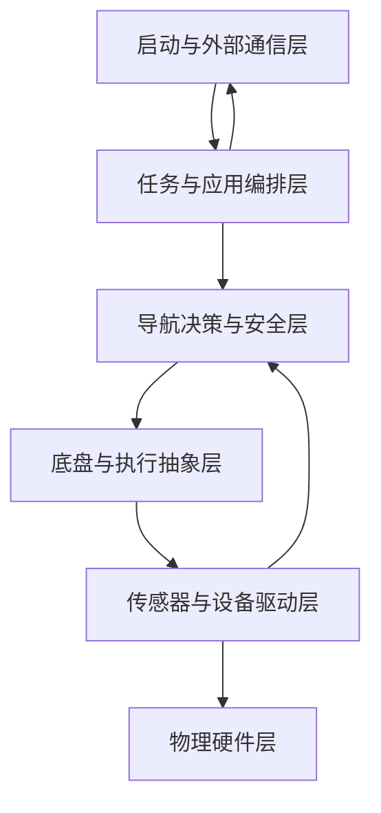

# AGV 系统总览

本项目是面向推料作业的移动机器人系统。现有代码按“外部通信 → 任务编排 → 导航与安全 → 底盘执行 → 设备驱动 → 物理硬件”六层组织。

## 六层架构

- [[Layers/启动与外部通信层]]
- [[Layers/任务与应用编排层]]
- [[Layers/导航决策与安全层]]
- [[Layers/底盘与执行抽象层]]
- [[Layers/传感器与设备驱动层]]
- [[Layers/物理硬件层]]

## 主控制链路

后端、手柄或轨迹任务产生作业意图，经任务编排和导航安全决策后，通过旧接口 `/motor_speed`、`/motor_command`、`/motor_brake` 或新接口 `/chassis/cmd` 进入底盘与执行层。

## 主状态链路

底盘、编码器、IMU、磁传感器、超声和电池表产生状态，经设备驱动发布为 ROS Topic，供任务层、导航层和 MQTT 桥接使用。

## 当前版本

- [[车辆版本图谱]]
- 当前知识图谱主源：三号车二代代码。
- 一号车、二号车保留为变体和兼容性证据。

## 跨域入口

- [[../02_Hardware/硬件系统总览]]
- [[../04_Navigation/导航系统总览]]
- [[../05_Control/控制架构总览]]
- [[../00_System/代码来源与扫描范围]]
