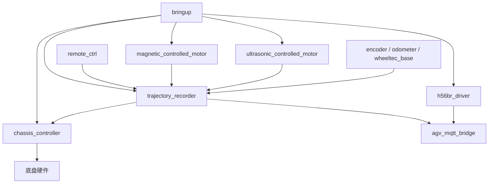

# ROS 系统总览

三号车当前主源包含 12 个现行或兼容 Package，另有 1 个停用包壳和 1 个归档包。逻辑 Package 跨车辆只建立一个节点，差异保存在节点内部。

## 启动与通信

- [[Packages/bringup]]
- [[Packages/agv_mqtt_bridge]]

## 任务编排

- [[Packages/trajectory_recorder]]
- [[Packages/remote_ctrl]]

## 导航与安全

- [[Packages/magnetic_controlled_motor]]
- [[Packages/ultrasonic_controlled_motor]]

## 底盘与执行

- [[Packages/chassis_controller]]
- [[Packages/wheeltec_base]]
- [[Packages/analog_controlled_motor]]
- [[Packages/relay]]

## 传感器与状态

- [[Packages/encoder]]
- [[Packages/odometer]]
- [[Packages/h56br_driver]]
- [[Packages/battery_management]]

## 状态说明

- `active`：当前主实现使用或明确保留。
- `compatibility`：用于旧底盘或可选部署，不代表默认启动。
- `inactive`：主源中只剩包壳或实现被删除。
- `archived`：明确归档，不用于当前实现。

## 跨域入口

- [[../01_Project_AGV/AGV系统总览]]
- [[../04_Navigation/导航系统总览]]
- [[../05_Control/控制架构总览]]
- [[../00_System/代码来源与扫描范围]]
