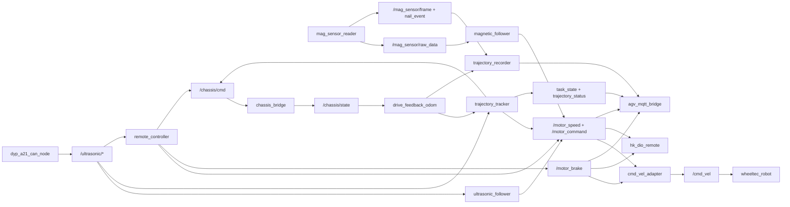

# ROS 节点与通信图

## 主控制链

- 新链：[[Nodes/trajectory_tracker]] 或 [[Nodes/remote_controller]] → [[Interfaces/chassis-cmd]] → [[Nodes/chassis_bridge]] → [[Interfaces/chassis-state]]
- 兼容链：多个控制源 → [[Interfaces/motor-speed]] / [[Interfaces/motor-command]] / [[Interfaces/motor-brake]] → [[Nodes/cmd_vel_adapter]] → [[Interfaces/cmd-vel]] → [[Nodes/wheeltec_robot_node]]

## 主感知链

- 磁导航：[[Nodes/mag_sensor_reader]] → [[Interfaces/mag-sensor-raw-data]] / [[Interfaces/mag-sensor-frame]] / [[Interfaces/mag-sensor-nail-event]] → [[Nodes/magnetic_follower]] 与轨迹系统
- 超声安全：[[Nodes/dyp_a21_can_node]] → [[Interfaces/ultrasonic-distance]] / [[Interfaces/ultrasonic-status]] → 跟踪、遥控和安全逻辑
- 底盘反馈：[[Nodes/chassis_bridge]] → [[Interfaces/chassis-state]] → [[Nodes/drive_feedback_odom]] → [[Interfaces/drive-feedback]]

## 注意

此图基于静态源码和 Launch。运行时实际节点、重映射和发布者必须通过 ROS 运行快照复核，尤其是 [[../05_Control/控制权仲裁]] 与 [[Interfaces/odom|/odom 多发布者问题]]。

## 关联

- [[ROS系统总览]]
- [[ROS接口目录]]
- [[Launch目录]]
