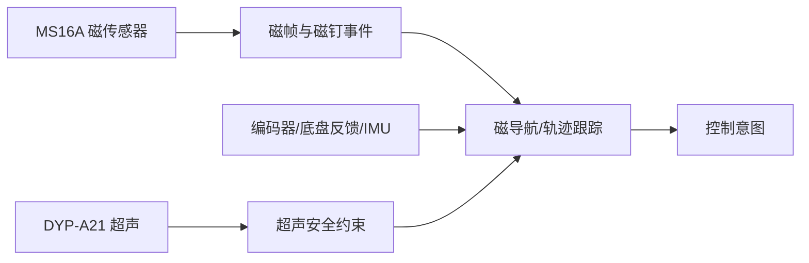

# 导航系统总览

## 能力组成

- [[磁导航与磁钉]]：读取原始磁信号、构造磁帧、识别磁钉并产生循线建议。
- [[超声安全与循墙]]：读取多方向距离和状态，参与限速、停车与避障。
- [[轨迹记录与跟踪]]：记录、保存、回放和跟踪实车轨迹。
- 里程与姿态：融合编码器、底盘反馈和 IMU。

## 边界

磁循线和超声模块可直接发布旧控制 Topic；三号车的主轨迹链还可发布 `/chassis/cmd`。多源同时控制时必须经过明确的模式管理或仲裁。

## 关联

- [[../01_Project_AGV/Layers/导航决策与安全层]]
- [[../05_Control/控制架构总览]]
- [[../05_Control/控制权仲裁]]
- [[../02_Hardware/硬件系统总览]]
